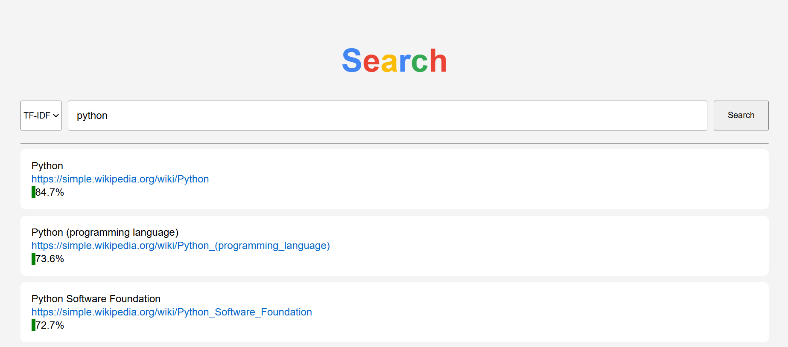

# search-engine
A search engine for simple english Wikipedia articles using Term Frequency-Inverse Document Frequency (TF-IDF) and Latent Semantic Analysis (LSA) with Singular Value Decomposition (SVD).

## Tech stack
- Python
- Numpy, scikit-learn
- FastAPI (API)
- HTML/CSS/Javascript (frontend)

## Installation
**Prerequisites:**
- Linux or wsl
- Python 3.12+
- 16GB+ RAM for computation
- At least few GB disk space

**Clone the repository:**
```bash
git clone https://github.com/Karol1092/search-engine.git
```
or if you are using ssh:
```bash
git clone git@github.com:Karol1092/search-engine.git
```

**Environment:**
```bash
python3 -m venv .venv
source .venv/bin/activate
pip install -r requirements.txt
```

**Run build script:**
```bash
python3 build.py
```

## Usage

**Start the app:**
```bash
./start.sh
```
Open http://localhost:5500/ in your browser.

You can choose plain TF-IDF or TF-IDF + LSA.

**Example:**


## Details

### Articles
Number of articles: ~250k. \
Articles with less than 150 letters were removed.

### Vocabulary
Number of terms in vocabulary: ~140k. \
Words than appeared in less than 5 documents were removed.

### Implementation
Wikipedia dump is parsed with: 
- mwxml (https://pypi.org/project/mwxml/)
- mwparserfromhell https://pypi.org/project/mwparserfromhell/0.3/) 
  
TF-IDF was implemented with `TfidfVectorizer` from `sklearn.feature_extraction.text`. 

SVD for LSA was implemented with `TruncatedSVD` from `sklearn.decompostion`. 

Matrices are stored as `csr_matrix` from `scipy.sparse` due to their sizes.


